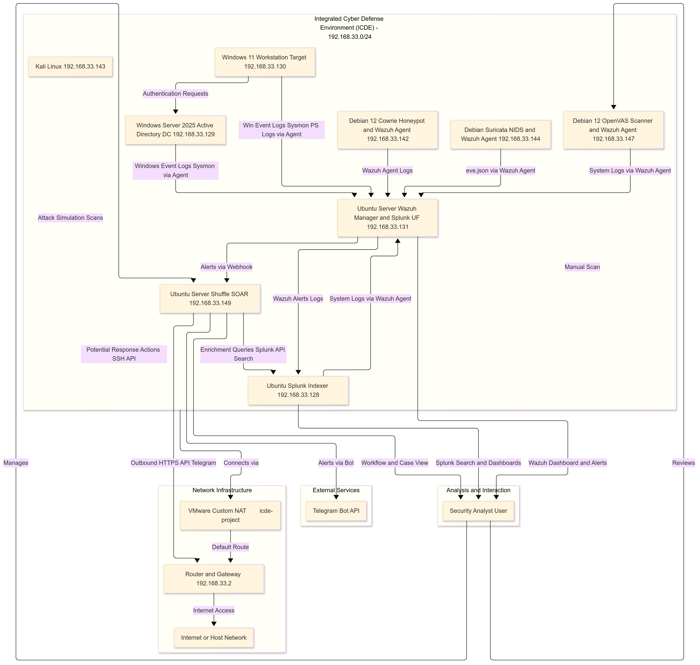

## 🖼️ Architecture Diagram

The diagram below illustrates the full data flow and logical structure of the Integrated Cyber Defense Environment (ICDE):

> This architecture depicts how each virtual machine, service, and tool interacts in the ICDE lab:
>
> - 🟡 **Wazuh** collects logs from endpoints, honeypot, Suricata, OpenVAS, and forwards alerts.
> - 🟣 **Splunk** serves as the central indexer for alert analytics and correlation via dashboard and API queries.
> - 🟢 **Shuffle** (SOAR) listens to Wazuh alerts via webhook and triggers response workflows (Telegram alerting, SSH API).
> - 🔵 **Kali Linux** acts as the red team simulator, initiating attacks.
> - 🧠 **Security Analyst User** uses dashboards, workflows, and bot alerts to monitor and respond.
> - 🌐 Network uses VMware NAT with default gateway `192.168.33.2`.

---

## 📁 Diagram File Location

The image should be stored in your repo under:

